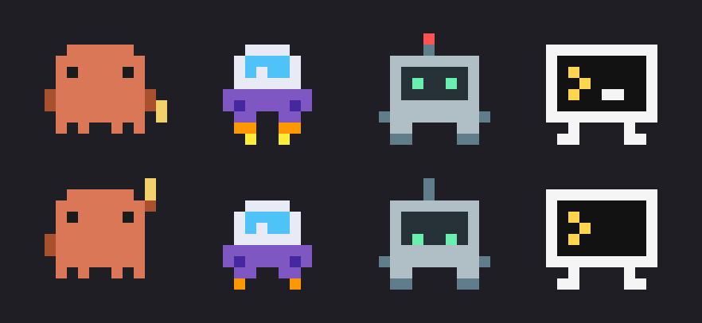
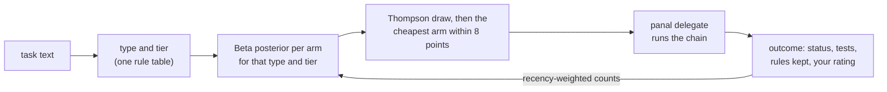

<div align="center">

# Panal

**A terminal dashboard for your AI coding agents that learns which one to hand each task to.**

[](go.mod)
[](LICENSE)
[](docs/getting-started.md)



</div>

Panal (Spanish for *honeycomb*) watches the coding agents you orchestrate
from Claude Code (**opencode**, **codex**, **agy**, **cursor-agent** and **Claude Code**
itself) and shows each one as a live card with a pixel-art mascot, its
status, model, task, last action and quota. It only reads the agents'
files; it never changes them.

`panal delegate` hands a task to codex, agy, opencode or cursor, falls back to
the next one when an agent is out of quota, and with `-c auto` lets a
small, explainable router pick the cheapest agent, model and effort that
has been getting that kind of task right **on your machine**.

```text
 ◆ Panal  live · every 2s · 15:04:05                  ■ 2 active ■ 1 no quota/permission ■ 1 at rest
   1 Dashboard   2 History   3 Report   4 Timeline   ? Help 
  claude orchestrating · agy working for 18 min · codex out of quota · codex: credits for ~23 days

┏━━━━━━━━━━━━━━━━━━━━━━━━━━━━━━━━━━━━━━━━━━━━━━━━┓╭────────────────────────────────────────────────╮
┃  CLAUDE                       ● orchestrating  ┃│  AGY                                ● working  │
┃                     ▄▄▄▄▄▄                     ┃│                      ▄▄▄▄                      │
┃                    █▀████▀█                    ┃│                     ██▀███                     │
┃                   ▄████████▄                   ┃│                    ▄▀▀▀▀▀▀▄                    │
┃                   ▀████████▀█                  ┃│                    ▀▀█▀▀█▀▀                    │
┃                    ▀ ▀  ▀ ▀                    ┃│                     ▀▀  ▀▀                     │
┃                                                ┃│                                                │
┃ model claude-3-7-sonnet                        ┃│ model gemini-2.5-pro                           │
┃ time  40 min                                   ┃│ time  18 min                                   │
┃ task  claude · Orchestrating agents and handi… ┃│ task  agy · Golden screen tests to catch layo… │
┃                                                ┃│                                                │
┃ quota active                                   ┃│ 5 h    █████████████░░░░░░░░  62% resets 16:39 │
┃                                                ┃│ week   ███████░░░░░░░░░░░░░  35% resets 29 Sep │
┗━━━━━━━━━━━━━━━━━━━━━━━━━━━━━━━━━━━━━━━━━━━━━━━━┛╰────────────────────────────────────────────────╯
╭────────────────────────────────────────────────╮╭────────────────────────────────────────────────╮
│  CODEX                         ◐ out of quota  ││  OPENCODE                              ○ idle  │
│                       ▀    ▀▄                  ││                   ▄▄▄▄▄▄▄▄▄▄                   │
│                    █▀▀▀▀▀▀█                    ││                   ██▀███████                   │
│                    ████████                    ││                   ██▀▀██████                   │
│                   ▄████████▄                   ││                   █▀▀▀▀▀▀▀▀█                   │
│                    ▀▀    ▀▀                    ││                    ▄█    █▄                    │
│   ⚠ modified 1 file outside what was allowed   ││                                                │
│                                                ││ model claude-3-5-sonnet                        │
│ model o3-mini                                  ││ time  2 h ago · took 15 min                    │
│ time  out of quota 3 h ago                     ││ task  opencode · Waiting for instructions for… │
│ task  codex · Optimize SQL queries in reports  ││                                                │
│                                                ││ quota Go plan available                        │
│ quota weekly quota used up                     ││                                                │
╰────────────────────────────────────────────────╯╰────────────────────────────────────────────────╯
 ←→  select   enter  detail   ?  help   q  quit
```

<sub>Real output of the golden screen test at 100 columns
(<code>internal/ui/testdata/screens/cards-100.txt</code>), with sample data.
In a terminal the cards are in color and the mascots move.</sub>

## Why Panal

- **Delegation stops being a guess.** `panal delegate -c auto` sorts each
  task into a type and a tier and picks the arm (`cli:model:effort`) with
  the best record for it, preferring the cheaper one. Every run teaches it,
  and you can correct it with `panal feedback` or `+` / `-` in History.
- **Explainable, local, plain Go.** No model and no service. `panal route`
  shows the tier rules that fired, each arm's estimate and the runs behind
  it. Everything it learns from lives on your disk.
- **One screen for every agent.** Live quotas asked of each CLI without
  spending any, run history, reports, a timeline, alerts, and what each
  run *really* changed, checked with git against the task's rules.
- **Your agents as pets.** A honeycomb above Claude Code's prompt (or a
  split pane next to any CLI) that opens into every agent's mascot, live.
  [See it](#your-agents-as-pets-inside-claude-code).
- **Read-only by design.** The only files Panal writes are its own, in
  `~/.panal`.

## Quick start

You need Go 1.27 or newer. Panal is developed and used on Windows; see
[Getting started](docs/getting-started.md) for macOS and Linux notes and
for connecting each agent.

```sh
go install github.com/AlbertoVasquezR/panal/cmd/panal@latest

panal -doctor                          # what it found, what it read, what is missing
panal                                  # the dashboard
panal route "Fix the typo in README"   # dry run: what the router would pick, and why
panal delegate -c auto -d ../wt "Fix the off-by-one in the pager; add a test"
```

Give `panal delegate` its own directory, ideally a dedicated git worktree
(`git worktree add ../wt -b fix`): the agent edits files there without
asking.

## How the router learns



1. **Classify.** One table of rules adds points (short task −1, "typo" −2,
   "migrate" +3…): −2 or less is *simple*, +2 or more is *complex*, the rest
   *medium*. The words match English and Spanish.
2. **Estimate.** Each arm keeps successes and failures per task type and
   tier, with a 30-day half-life, as a Beta distribution. With few runs it
   leans on the arm's record at that tier, then on a prior that expects
   cheap arms to do well at simple tasks and strong arms at complex ones.
3. **Choose.** Thompson sampling: draw a success rate per arm and take the
   cheapest arm within 8 points of the best draw. Uncertain arms sometimes
   win the draw, which is how it explores; exploration fades as runs pile
   up. Arms whose CLI is out of quota go last.
4. **Learn.** A run is a success if it ended `done`, broke none of the
   task's rules and its last tests passed. Your rating always wins.

```text
$ panal route "Migrate the whole repo to the new configuration API"
task   Migrate the whole repo to the new configuration API
type   feature
tier   complex  (score +6: short task -1, feature +1, migration +3, whole codebase +3)
pool   3 arms from -p, cheapest first

    arm                           est.   draw  runs: cell · tier · all  note
    codex:gpt-6-luna:low           21%   0.34  0/1 · 0/2 · 9/11
    agy:gemini-3.8-flash-medium    56%   0.63  0/0 · 0/0 · 3/4
  → codex:gpt-6-luna:high          93%   0.73  3/3 · 3/3 · 3/3         favorite

chain  codex:gpt-6-luna:high agy:gemini-3.8-flash-medium codex:gpt-6-luna:low
auto: codex:gpt-6-luna:high — feature · complex · 3/3 ok in the last 30 days (exploring 1 in 7)
```

The cheap arm, which keeps winning simple fixes, failed the complex tasks
it tried, so the strong one gets this one. `est.` is the estimated chance
of success, `draw` this decision's random draw, and `runs` the record
behind it (this type and tier · this tier · all tasks). Rules, priors and
formulas: [docs/router.md](docs/router.md).

## Commands

| command | what it does |
|---|---|
| `panal` | the dashboard (`-every 5s`, `-theme`, `-off`, `-alerts`, `-no-animation`) |
| `panal -doctor` | which sources were found, what was read, what to configure |
| `panal delegate -d DIR [-r] [-t 15m] [-c CHAIN\|auto] "task"` | hand a task to codex, agy or opencode, with quota fallback |
| `panal route [-r] [-p POOL] "task"` | what `-c auto` would pick and why, without running anything |
| `panal route -stats` | what the router has learned: arm × type × tier |
| `panal models [-refresh]` | the models each CLI lists, their estimated cost, which the router may pick |
| `panal feedback RUN good\|bad\|clear [note]` | rate a run (`last` is the newest finished one) |
| `panal -report 7 [-format text\|md\|csv\|json]` | per-agent report of the last N days |
| `panal -summary` · `-history` · `-once` | today as markdown · past runs · the status as text |
| `panal -statusline` | the status on one line, for Claude Code's status line or tmux |
| `panal pet [-agent NAME] [-json\|-stream]` | one mascot for a small split pane, or its frames as JSON for other programs |
| `panal -serve :8765` | serve this machine's status to another dashboard |
| `panal -preview 100 [-screen history]` · `-mascots` | draw one screen, or the mascots, and exit |

Each subcommand has its own `-h`. Details in [delegate](docs/delegate.md),
[router](docs/router.md), [models](docs/models.md) and
[reference](docs/reference.md).

## Your agents as pets, inside Claude Code

Keep your agents in sight while you work, without leaving Claude Code. The
`panal-pet` plugin puts a tiny honeycomb at the right of the prompt, one cell
per agent in its status color. Hover it (or click **Panal** to pin it) and
every agent's mascot pops up, live: working, celebrating a finished run,
shaking at a failure, napping when there is nothing to do.

```text
     ▄▄▄▄▄▄           ▄▄▄▄                ▀
    █▀████▀█         ██████  ▄       █▀▀▀▀▀▀█ ▄
   ▄████████▄       ▄▀▀▀▀▀▀▄         ████████
   ▀████████▀█      ▀▀█▀▀█▀▀        ▄████████▄
    ▀ ▀  ▀ ▀         ▀▀  ▀▀          ▀▀    ▀▀
    claude ●          agy ✔            codex ✔
                                                              ⬢⬢⬢ Panal
❯ _
```

```text
/plugin marketplace add AlbertoVasquezR/panal
/plugin install panal-pet@panal
```

`/panal pane` shows a card per agent instead (mascot, status, model and what
it is doing right now); `/panal off` hides it.

Using Codex or another CLI? `panal pet` is the same pet for a small split
pane:

```sh
wt -w 0 sp -V -s 0.25 panal pet        # Windows Terminal, a pane on the right
tmux split-window -h -l 24 panal pet   # tmux
```

`panal pet -json` / `-stream` (add `-all` for every agent) give the frames
as JSON for any other plugin or status bar. Details: [docs/pet.md](docs/pet.md).

## Keys

| key | action |
|---|---|
| `1` `2` `3` `4` | Dashboard, History, Report, Timeline |
| `← →` · `enter` / `tab` | select an agent · open its detail |
| `l` · `d` | full log · the real diff of the run |
| `t` · `m` · `p` | cards or table · show or hide mascots · pet a mascot |
| `r` | ask every CLI for its quota now |
| `+` / `-` | in History: rate the run for the router |
| `?` · `q` | every key and glyph · quit |

Every key, per view: [docs/dashboard.md](docs/dashboard.md#keys).

## Configuration

Optional. `~/.panal/panal.conf` (or `PANAL_CONF`) is re-read when it
changes; flags and environment variables win over it.

```ini
pool             = auto            # the router picks among the discovered models
models           = codex:gpt-6-luna* agy:gemini-3.8-flash-*
exclude          = agy:claude-*
pool_max_per_cli = 4
theme            = auto            # auto, dark, light, contrast
alerts           = bell            # all, bell, none
```

Every key and variable: [docs/configuration.md](docs/configuration.md).

## Supported agents

| agent | what Panal reads |
|---|---|
| **Claude Code** | the status line JSON saved by [`scripts/statusline.sh`](scripts/statusline.sh) (model, context, cost, rate limits) and its session transcript for the last action; live quota through a `get_usage` control request (no turn) |
| **codex** | `panal delegate` runs and logs (activity, tests); `rate_limits`, tokens and credits from `~/.codex/sessions`; live quota from `codex app-server` (no turn) |
| **agy** | `panal delegate` runs and logs, including the quota summary in its log; live quota from `agy -p /usage` (no turn) |
| **opencode** | `panal delegate` runs; quota errors in its log; `opencode.db` (read-only); Go plan usage from opencode's usage endpoint |
| **cursor** (`cursor-agent` / `agent`) | `panal delegate` runs and their stream-json logs (status, model, last action); the CLI on `PATH` or `%LOCALAPPDATA%\cursor-agent` for `-doctor`. No live quota: cursor-agent has no usage query that spends nothing (`/usage` is interactive only) |

## Docs

| guide | for |
|---|---|
| [Getting started](docs/getting-started.md) | install, connecting each agent, first run, `-doctor` |
| [Dashboard](docs/dashboard.md) | views, cards, keys, glyphs, mascots, alerts, themes |
| [Pet](docs/pet.md) | `panal pet`: the mascot for a split pane, and its JSON frames |
| [Delegating](docs/delegate.md) | `panal delegate`: flags, chain, exit codes, sandboxing, files |
| [Router](docs/router.md) | tiers, outcomes, priors, Thompson sampling, feedback, external router |
| [Models](docs/models.md) | discovery, cache, `pool = auto`, `models` / `exclude`, cost heuristic |
| [Configuration](docs/configuration.md) | every config key and environment variable |
| [Reference](docs/reference.md) | run file schema, reports, multiple machines, status line, pet frames |
| [Architecture](docs/ARCHITECTURE.md) | packages and data flow, for contributors |

## Contributing

Issues and pull requests are welcome. Start with
[CONTRIBUTING.md](CONTRIBUTING.md) and
[docs/ARCHITECTURE.md](docs/ARCHITECTURE.md); AI agents working on the
repo follow [AGENTS.md](AGENTS.md).

```sh
go build ./... && go vet ./... && go test ./...
```

## License

[Apache-2.0](LICENSE) © AlbertoVasquezR. See [NOTICE](NOTICE).
