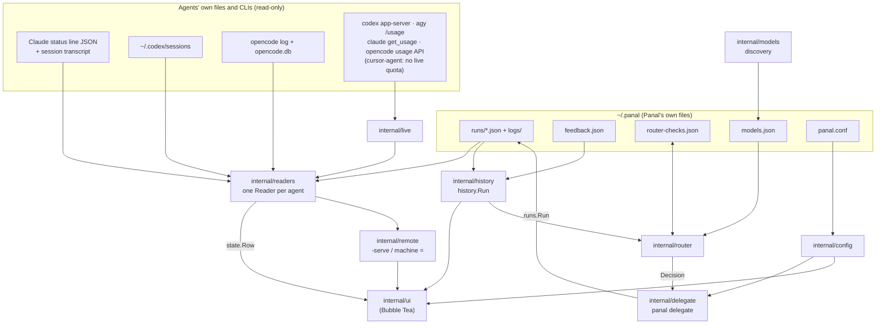

# Architecture

How Panal is put together: where data comes from, which package owns
what, and the few types everything passes around. Read this before a
change that crosses packages; [AGENTS.md](../AGENTS.md) has the rules.

See also: [CONTRIBUTING.md](../CONTRIBUTING.md) ·
[Reference](reference.md) · back to the [README](../README.md).

## Data flow

- **Dashboard:** every 2 s the UI asks each `readers.Reader` for a
  `state.Row`. Readers only read files; `internal/live` runs the CLIs'
  quota queries in the background and readers merge the newest answer.
- **Delegating:** `panal delegate` builds a chain (by hand or from the
  router), runs each CLI, and writes a `runs.Run` file per attempt. Those
  files feed the readers (cards), `internal/history` (History, Report,
  Timeline) and, through history, the router.
- **Router:** `internal/router` turns history plus ratings plus cached
  checks into evidence, learns per arm × type × tier and returns a
  `Decision`. `internal/models` supplies the discovered models for
  `pool = auto`.

## Packages

| package | owns |
|---|---|
| `cmd/panal` | flags, subcommand dispatch (`delegate`, `route`, `models`, `feedback`, `pet`), wiring config to the UI |
| `cmd/preview` | renders every mascot frame to a PNG (`docs/animations.png`) |
| `internal/state` | the shared model: `Row`, `Status`, `Quota`, `Bar` |
| `internal/readers` | one reader per agent (claude, agy, codex, opencode, cursor) plus delegated runs; `Sources` for `-doctor` |
| `internal/live` | live quota queries to the CLIs (codex app-server, agy `/usage`, claude `get_usage`, opencode usage API) |
| `internal/runs` | the run file format, its directories and `~/.panal` (`Home`); `legacy.go` reads delegar.sh files |
| `internal/history` | past runs with tokens, cost, ratings and full tasks, for History, Report, Timeline and the router |
| `internal/delegate` | `panal delegate`, `panal route`, `panal models`: chain parsing, each CLI's command line, quota and permission classification, process trees |
| `internal/router` | tiers (`tier.go`), outcomes and the checks cache (`evidence.go`), posteriors (`posterior.go`), Thompson choice (`router.go`), external router, report summary |
| `internal/models` | model discovery, the `models.json` cache, the cost heuristic, `pool = auto` rules |
| `internal/feedback` | `panal feedback` and `feedback.json` |
| `internal/changes` | what a run really touched (git, read-only) against the task's rules; diffs |
| `internal/activity` | the last thing an agent did, loops and tests, from the tail of its log |
| `internal/credits` | codex credit spending from its sessions |
| `internal/forecast` | quota samples and when each window will run out |
| `internal/report` | task types, `-report` (text, md, csv, json) and `-summary` |
| `internal/remote` | `-serve` and reading other machines |
| `internal/config` | `panal.conf`, which agents are off |
| `internal/alerts` | Windows notifications, the bell, ntfy and webhooks |
| `internal/mascots` | sprites and animations; `Cells` is the half-block encoding the dashboard and the pet share |
| `internal/ui` | Bubble Tea model, views, keys, palette; draws only what the others provide |
| `internal/pet` | `panal pet`: picks the agent and mood (reusing `ui.StatusMode`, `ui.ReactionForChange`), its small Bubble Tea view, the `-json`/`-stream` frames |

## Key types

| type | where | what |
|---|---|---|
| `readers.Reader` | `internal/readers/reader.go` | `Agent() string` and `Read() state.Row`; called every refresh, so it must be cheap |
| `state.Row` | `internal/state/state.go` | one agent's status, model, task, activity, quota bars, detail |
| `runs.Run` | `internal/runs/runs.go` | one attempt's run file ([schema](reference.md#run-files)) |
| `history.Run` | `internal/history/history.go` | a run enriched with tokens, cost, model id, rating and full task |
| `delegate.Link` | `internal/delegate/chain.go` | a chain link `cli:model[:effort]` |
| `router.Evidence` | `internal/router/evidence.go` | one past run reduced to arm, type, tier, time and outcome |
| `router.Decision` | `internal/router/router.go` | type, tier, estimates, draws, chain, favorite and the one-line reason |
| `models.Catalog` | `internal/models/models.go` | the discovered models per CLI (`models.json`) |
| `config.Conf` | `internal/config/config.go` | what `panal.conf` says |

## Testing

- Readers and parsers are tested against **real captured samples** in
  each package's `testdata/`.
- `internal/delegate` tests run the test binary itself as a fake codex,
  agy, opencode and cursor; `internal/router` tests run it as a fake external
  router; `internal/models` tests answer the listing commands with real
  outputs (cursor-agent's listing is reconstructed from public slugs).
  No test runs a real agent.
- Thompson sampling is seeded (`math/rand/v2` PCG) in tests.
- The UI has golden screens in `internal/ui/testdata/screens/` (cards,
  table, detail, history, history detail, report, timeline and help at 80,
  100, 132 and 160 columns).
