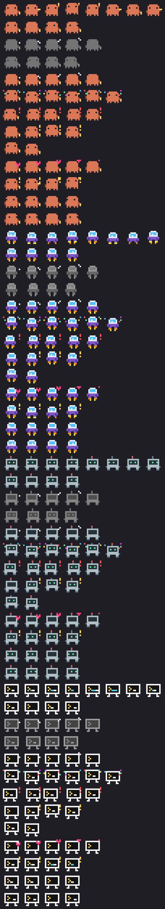

# The dashboard

`panal` opens a full-screen view of your agents: one card per agent, plus
History, Report and Timeline views. This page covers every view, key,
glyph, mascot animation, alert and theme.

See also: [Getting started](getting-started.md) ·
[Configuration](configuration.md) · back to the [README](../README.md).

## Views

| key | view | what it shows |
|---|---|---|
| `1` | **Dashboard** | one card per agent (or a compact table with `t`) |
| `2` / `h` | **History** | past runs grouped by day, with filters, search and ratings |
| `3` / `i` | **Report** | per agent over 7 or 30 days, and agent × task type |
| `4` | **Timeline** | the day's runs on an hour axis, one line per agent |
| `?` | **Help** | every key, glyph and color |

Under the title, one sentence says what is going on: who is working and
since when, who is in trouble and how many days codex's credits will last.
The footer shows the main keys; `?` shows all of them.

### Cards

Each card has the agent's animated mascot, status, model, time, task and
quota bars: green, amber from 60 %, red from 85 %, with the reset time. The
selected card gets a thick border in its agent's color. Four per row if
they fit, otherwise 2×2, and a single column in a very narrow terminal.
At the top, a count of agents active, out of quota or permission, and at
rest.

- **Task** is shown as **project · task**: the directory name and the task's
  goal, without its boilerplate rules ("you may only…", "do not commit…").
  If the task has a `Goal:` line, that is the task.
- **Model names** are shortened (`luna`, `gemini-3.8-flash`); the detail
  view shows them in full.
- **At rest**, a card says how long ago the agent finished and how long it
  took, and if its last reviewed run broke the task, it says so in red
  (for example, that it modified a file outside what was allowed).
- **What it's doing now.** While an agent works, the line under its mascot
  shows the last thing it did, from the tail of its log: the command it ran
  (`› $ go test ./...`), the tool it used (`› Reading README.md`) or the last
  thing it said, and how long ago if that was more than a minute. For
  claude it comes from the last tool call in its session transcript.
- **Stuck in a loop?** If a working agent's last actions are the same
  command 3 or more times in a row, `›` becomes `⟳ ×4 $ go test ./...` in
  amber; on the fourth time you get an alert (once per command).
- **Tests.** If codex ran tests in its run (`go test`, `pytest`, `npm test`,
  `vitest`, `jest`, `cargo test`…), the card says how the last ones went:
  `✓` and the command in green, or `✗`, the number of failures and the
  command in red.
- **Claude's context.** The claude card shows how much of its context
  window the session has used and its cost so far (amber from 60 %, red
  from 85 %). While codex works, its card shows how much of its context
  window the last turn filled.
- **Codex credits.** The codex card shows today's spending, the daily
  average (last 7 days with data) and how many days the balance will last;
  amber if less than a week.

Everything adapts to the terminal size: cards drop the mascot when they
don't fit, then the compact table is used; table and history columns
shrink or disappear; the footer wraps; long paths are trimmed in the
middle.

### Detail, log and diff

- **Detail** (`enter` / `tab`): the reader's data as label / value pairs.
  For a run (and for an agent's last run) it shows **what it really
  touched** in its directory, without taking the agent's word for it:
  uncommitted files modified during the run (with +/− lines) and the
  commits made during it, checked against the task's rules (which files it
  may modify or create, whether it may commit, read-only runs). Anything
  outside goes in red. Commits are searched in the worktree's history
  (HEAD), so a parallel run in another worktree isn't counted. git runs
  with `--no-optional-locks`: it never touches the index.
- A run file keeps only the first line of the task, so Panal looks for the
  full task in the run's `task_file`, in agy's log or in the codex session,
  and accepts it only if it starts like the stored line.
- **Diff** (`d`): `git diff HEAD` of the files the run touched, new files
  in full and `git show` of its commits.
- **Log** (`l`): the log, full screen, following the end while it grows
  (scrolling up releases it; `G` resumes). It hides agy's noise (Go log
  lines and stack traces); `r` shows it.

### History

At the top, a panel for today (runs, results, agent time, credits) and one
per agent. Below, the runs grouped by day, with the agent in its color and
the result as a badge. Runs that broke their task are marked ⚠; rated runs
▲ (good) or ▼ (bad). The run detail shows the rating, the task's type and
tier and, for runs the router picked, why.

### Report

Per agent over the last 7 or 30 days: runs, what percentage finished well,
failures, out of quota, how many broke their task, median duration,
credits and tokens. Below, an **agent × task type** matrix (review, fix,
tests, refactor, docs, feature, other) with "no failure / runs" per cell
(green from 80 %, amber from 50 %, red below). At the end, what was
delegated: runs finished by agents other than claude and the tokens Claude
didn't spend; with `claude_price` set it estimates the money. "Broke the
task" only counts runs already reviewed. The same report is available as
text, markdown, CSV or JSON: see [Reference](reference.md#reports).

### Timeline

One line per agent with the day's runs on an hour axis: `█` done, `▓`
running, `░` out of quota or permission, `▚` failed (the shape tells you
what happened even without colors), and `│` marks the current time. Below:
how many runs, how much agent time and the longest run.

## Keys

The same list as the help screen (`?`).

| view | key | action |
|---|---|---|
| **Dashboard** | `← →` / `↑ ↓` | move the agent selection |
| | `enter` / `tab` | detail of the selected agent |
| | `1` `2` `3` `4` | switch view (Dashboard, History, Report, Timeline) |
| | `h` / `i` | open History or Report |
| | `l` | full log of the last run |
| | `d` | actual diff of the last run |
| | `c` / `w` | open its directory in VS Code / in a new Windows Terminal tab |
| | `t` | toggle between cards and the compact table |
| | `m` | show or hide mascots |
| | `p` | pet the selected agent's mascot |
| | `r` | ask codex, agy, claude and opencode for their quota now |
| | `?` | help |
| | `q` | quit |
| **Agent detail** | `← →` | switch agent |
| | `↑ ↓` / `j k` | scroll |
| | `PgUp` / `PgDn` | page up or down |
| | `g` / `G` / `Home` / `End` | top or bottom |
| | `l` · `d` | log · diff of the last run |
| | `esc` / `tab` / `enter` | back to the dashboard |
| **History** | `↑ ↓` / `j k` | move the run selection |
| | `PgUp` / `PgDn` · `g` / `G` | page · first or last run |
| | `enter` / `tab` | detail of the selected run |
| | `/` | search text in task, model or directory (`enter` keeps it, `esc` clears it) |
| | `f` | filter by agent (all → claude → agy → codex → opencode) |
| | `e` | filter by result (failures, quota, done, running) |
| | `l` · `d` · `c` / `w` | log · diff · open its directory |
| | `+` / `-` | rate the run good or bad (again: clear); the router learns from it |
| | `esc` / `h` | back to the dashboard |
| **Run detail** | `← →` | previous or next run |
| | `↑ ↓` / `j k` · `PgUp` / `PgDn` · `g` / `G` | scroll |
| | `l` · `d` | log · diff of the run |
| | `+` / `-` | rate the run (again: clear) |
| | `esc` / `tab` / `enter` | back to the list |
| **Log and diff** | `↑ ↓` / `j k` · `PgUp` / `PgDn` · `g` / `G` | scroll |
| | `r` | show or hide noise in the log (Go log lines, traces) |
| | `esc` / `q` | close the viewer |
| **Timeline** | `← →` | previous or next day |
| | `esc` | back to the dashboard |
| **Report** | `← →` / `tab` | switch between 7 and 30 days |
| | `7` | 7 days |
| | `esc` / `i` | back to the dashboard |

## Glyphs

| glyph | meaning |
|---|---|
| `●` green | working: in the middle of a run |
| `●` blue | orchestrating: Claude Code is directing the agents |
| `✔` | done: it ended its turn (that doesn't mean it went well) |
| `✖` | failed, or stuck (process alive but no progress in the log) |
| `◐` | out of quota; `panal delegate` moved on to the next agent |
| `⊘` | no permission: the CLI refused and the turn was aborted |
| `○` | idle: at rest, no active process |
| `⏻` | off: at rest and turned off in the config (shown on one line, no card) |
| `⚠` | broke the task: touched files it wasn't allowed to, or made a forbidden commit |
| `✦` | unseen: its run ended while you were away; `enter`, `l` or `d` clears it |
| `▲` / `▼` | you rated the run good / bad |
| `★ N` | its last N runs (3 or more) all ended `done`; running and skipped runs don't break the streak |
| `≈` | a quota that couldn't be confirmed in the last 15 min |
| `⚠ ~15:40` | at this pace the quota runs out at 15:40, before its reset |

## Mascots

Each agent has a pixel-art mascot (hide them with `m`), animated by status:

| status | animation |
|---|---|
| working / orchestrating | its own work cycle: claude conducts with a baton, agy floats, codex scans with its eyes, opencode types |
| idle / done / no data | almost still: blinks out of sync and looks around now and then |
| idle for more than 2 h | nap: eyes closed and a z, still in color |
| out of quota / no permission / failed | asleep: grey, eyes closed, a rising z |
| stuck | grey and trembling |
| a quota or the context at 80 % or more | a drop of sweat |

And it reacts for a few seconds, with a line of text:

| when | reaction |
|---|---|
| it starts working | opens its eyes, a "!" and a hop |
| it finished a run | jumps with confetti |
| it failed, got stuck or ran out of quota | trembles with a red "!" |
| you select it | a hop |
| `p` | you pet it: eyes closed and a heart |
| another agent starts while claude orchestrates | claude raises the baton |
| another agent finishes or fails | the calm ones turn to look |

Every frame, by mode:

The sprites live in `internal/mascots` (each letter is a palette pixel,
`.` is transparent). Render every frame to a PNG with
`go run ./cmd/preview docs/animations.png`, or draw them in the terminal
with `panal -mascots`.

To keep one mascot next to an agent CLI in a small split pane, or to draw
it from another program, see [Panal as a pet](pet.md).

## Live quota

Each agent reports its quota only when it runs, so while the dashboard is
open Panal asks the CLIs themselves, with queries that start no turn and
spend no quota:

| agent | how | how often |
|---|---|---|
| codex | `codex app-server` → `account/rateLimits/read` | every 60 s; 30 s from 75 %, 15 s from 90 %, 5 s from 99 % |
| agy | `agy -p /usage --output-format json` | every 5 min |
| Claude Code | `claude -p` in stream-json with only a `get_usage` control request, hooks off, session not saved | every 5 min |
| opencode (Go plan) | `GET https://opencode.ai/zen/go/v1/usage` with the key opencode keeps | every 5 min |

Every agy and Claude Code answer is checked: if one ever shows a turn or a
cost, Panal stops asking for that session. Your Claude credentials are
never read; the CLI does the asking. `r` asks all four now. Turn it off
with `live_quota = no` (or `PANAL_LIVE_QUOTA=no`).

- **Resets.** If a window's reported reset time has passed, it is shown at
  0 % as already reset, and if it kept the agent out of quota, the agent is
  available again.
- **Forecast.** From the pace of the last hour, each bar estimates when it
  will hit 100 %. If that is before the reset, it turns amber with
  `⚠ ~15:40`, and with less than an hour left you get an alert (once per
  window). Samples are saved to `~/.panal/samples.json`.

## Alerts

When a delegated run ends (done, out of quota, failed…), an agent gets
stuck or repeats itself, or a quota is about to run out, you get:

- a banner at the top for 30 s;
- the terminal bell;
- on Windows, a notification (mode `all`, the default);
- if configured, the same alert to an [ntfy](https://ntfy.sh) topic
  (`ntfy = …`) and/or a JSON webhook (`webhook = …`, Slack, Discord or
  anything that accepts a POST), at most 6 per minute.

`-alerts bell` or `alerts = bell` keeps only the bell; `none` turns them
off. Nothing old is announced when the dashboard opens. Outbound alerts
are the only thing the dashboard sends off your machine, and only if you
configure them.

The **window title** shows what needs attention (unseen runs, agents
working, agents in trouble) followed by `— Panal`, or just `Panal` when all
is calm.

## Themes and accessibility

| option | effect |
|---|---|
| `-theme auto` (default) | follow the terminal's background |
| `-theme dark` / `-theme light` | force a palette when the terminal reports its background wrong |
| `-theme contrast` | raise the contrast of dim text, borders and empty bars |
| `NO_COLOR` | no colors and no mascots; status stays readable from glyph and word |
| `-no-animation` (or `PANAL_NO_ANIMATION=1`, `animation = no`) | still mascots, no reactions, for SSH or slow terminals |

`PANAL_THEME` and `theme = …` set the theme too. Design rules for
contributors are in
[.claude/skills/panal-ux/SKILL.md](../.claude/skills/panal-ux/SKILL.md).
