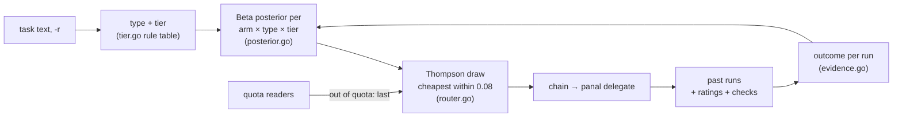

# The router

`panal delegate -c auto` picks which agent, model and effort gets a task,
from how your past runs went. It is plain Go in `internal/router`: no
model, no service, and every decision can be explained with `panal route`.

See also: [Delegating](delegate.md) · [Models](models.md) ·
[Configuration](configuration.md) · back to the [README](../README.md).



## Arms and the pool

An **arm** is a chain link, `cli:model[:effort]`. The router picks among
the **pool**, which is listed **cheapest first**: an arm's place in the
list is its cost rank.

```ini
pool = codex:gpt-6-luna:low agy:gemini-3.8-flash-medium codex:gpt-6-luna:high
```

The pool comes from `PANAL_POOL`, else `pool = ...` in `panal.conf`, else
the chain (`PANAL_CHAIN` / `chain = ...`, when it is not `auto`), else
every installed CLI. `pool = auto` builds it from the models each CLI
lists: see [Models](models.md). `panal route -p "..."` tries another pool
without touching the config.

When a pool is configured and no chain is, `auto` is the default for
`panal delegate`; an explicit chain (or `-c`) always wins. A past run whose
arm the pool doesn't name counts for that CLI's bare arm (`codex`) when
the pool has one; otherwise it only shows in `-stats`.

## Type and tier

The **type** is the one the report uses (`internal/report/types.go`):
`review`, `fix`, `tests`, `refactor`, `docs`, `feature` or `other`.
Read-only tasks, and tasks whose first sentence asks for a review, are
reviews; otherwise the type with the most keyword matches wins.

The **tier** comes from one table of rules in `internal/router/tier.go`.
Sizes and keywords are measured on the task's **goal**: its rule phrases
("you may only modify…", "do not commit…") are dropped first. The points of
the rules that apply are added up; each rule counts once.

| rule (as `panal route` prints it) | points | applies when |
|---|---|---|
| `short task` | −1 | the goal is under 200 characters |
| `long task` | +1 | 1500 to 3999 characters |
| `very long task` | +2 | 4000 characters or more |
| `many steps` | +1 | 4 or more numbered or bulleted lines |
| `read-only` | −1 | `-r` |
| `one allowed file` | −1 | the task allows modifying exactly one file |
| `many allowed files` | +1 | 5 or more allowed files and directories |
| `allowed directories` | +1 | any allowed directory |
| `docs` | −1 | type `docs` |
| `refactor` | +1 | type `refactor` |
| `feature` | +1 | type `feature` |
| `migration` | +3 | migrate, port to… (*migra*, *migración*) |
| `redesign or rewrite` | +3 | redesign, re-architect, rewrite, overhaul, from scratch (*rediseña*, *reescribe*, *desde cero*) |
| `whole codebase` | +3 | the whole / entire repo, codebase or project, across the repo, every package / module / file (*todo el repo*, *cada archivo*…) |
| `architecture` | +3 | architecture, architectural (*arquitectura*) |
| `small change` | −2 | typo, one-liner, a single line, rename, tiny, trivial, small, minor, quick fix, bump the version (*errata*, *renombra*, *una línea*, *pequeño*…) |

**−2 or less is `simple`, +2 or more is `complex`, anything else is
`medium`.** The Spanish words are there to match tasks written in Spanish.
A new rule needs a test in English and in Spanish
(`internal/router/tier_test.go`).

## What counts as a success

Every past run (except Claude Code's own) becomes an outcome
(`OutcomeOf` in `internal/router/evidence.go`):

| outcome | when |
|---|---|
| **no signal** | `running`, `out_of_quota` or `skipped`: the arm never really worked on it. Also `interrupted` without a rating |
| **your rating wins** | rated `good` → success, rated `bad` → failure, whatever the status said |
| **success** | `done`, broke none of the task's rules, and if tests were seen in its activity (codex), the last ones passed |
| **failure** | `failed`, `timeout`, `no_permission`; or `done` but it broke a rule or its last tests failed |

"Broke a rule" is the same check as the dashboard's real changes: git, read
only, against the files the task allows and whether it may commit. Checks
of finished runs are cached in `~/.panal/router-checks.json`; the run that
ends a delegation is checked right away.

Runs recorded before the router existed (no `task_type` / `tier` in the
run file) are classified from their task text when they are read.

## How it learns

For each arm, Panal counts successes **S** and failures **F** at three
levels: the arm overall, the arm at a tier, and the arm at a type and tier
(the **cell**). Each run is weighted by its age:

> weight = 0.5 ^ (age / 30 days)

so a run from 30 days ago counts half as much as one from today.

**Prior.** Before any run, the expected success rate depends on the tier
and on the arm's cost rank *r*, from 0 (cheapest) to 1 (strongest),
linearly across the pool (*r* = 0.5 for a pool of one):

| tier | cheapest → strongest |
|---|---|
| simple | 0.80 → 0.85 (0.80 + 0.05 r) |
| medium | 0.60 → 0.80 (0.60 + 0.20 r) |
| complex | 0.35 → 0.75 (0.35 + 0.40 r) |

**Lift.** An arm that beats what the prior expected of it overall is
trusted a bit more everywhere:

> lift = (S_arm + 1) / (expected successes + 1), clamped to [0.5, 2]

where *expected successes* is the sum over its runs of weight × prior.
The lift multiplies the prior's **odds**, so the result stays a
probability: base = odds · lift / (1 + odds · lift).

**Posteriors.** Two Beta distributions, each leaning on the level above:

> (arm, tier) = Beta(3 · base + S_tier, 3 · (1 − base) + F_tier)
>
> (arm, type, tier) = Beta(k · m + S_cell, k · (1 − m) + F_cell)

where *m* is the (arm, tier) mean and *k* = min(5, the (arm, tier)
evidence). The prior is worth 3 runs, and the tier's record at most 5 runs
of the cell. The last one is what is sampled.

## How it chooses

1. Draw a success rate from each arm's posterior (Thompson sampling).
2. Take **the cheapest arm whose draw is within 0.08 of the best draw**.
   Repeat among the arms left to order the rest of the chain.
3. Arms whose CLI is out of quota right now (from the same cheap reads as
   the dashboard; nothing is launched) go to the end, in the same order.

The **favorite** is the arm the same ordering gives with each posterior's
mean instead of a draw. When the first pick isn't the favorite, the run is
recorded as **explored**. Uncertain arms sometimes draw high, which is how
the router explores; as runs pile up the posteriors narrow and exploration
fades on its own. `panal route` estimates how often it explores for a task
from 200 extra draws ("exploring 1 in 9").

## `panal route`: the dry run

`panal route` shows what `-c auto` would do, without running anything.

```sh
panal route "task"                 # or -f task.md, -f - for stdin
panal route -r "Review internal/ui"
panal route -p "codex::low agy codex::high" "task"   # another pool
panal route -p auto "task"         # the discovered models
panal route -seed 7 "task"         # repeat the same random draws
panal route -d DIR "task"          # DIR is passed to an external router
```

```text
$ panal route "Fix the typo in README"
task   Fix the typo in README
type   fix
tier   simple  (score -3: short task -1, small change -2)
pool   3 arms from -p, cheapest first

    arm                           est.   draw  runs: cell · tier · all  note
  → codex:gpt-6-luna:low           97%   0.99  4/4 · 9/9 · 9/11        favorite
    agy:gemini-3.8-flash-medium    83%   0.98  0/0 · 0/0 · 3/4
    codex:gpt-6-luna:high          87%   0.99  0/0 · 0/0 · 3/3

chain  codex:gpt-6-luna:low agy:gemini-3.8-flash-medium codex:gpt-6-luna:high
auto: codex:gpt-6-luna:low — fix · simple · 4/4 ok in the last 30 days (exploring 1 in 11)
```

`est.` is the posterior mean, `draw` this decision's Thompson draw, and
`runs` the raw record behind it: this type and tier · this tier · every
task. `note` says `favorite`, `◐ out of quota now`, or the prior when the
arm has no runs at all. The last line is the one-line reason
`panal delegate` records in the run file.

With `-stats`, the learned table:

```text
$ panal route -stats
learned from 18 runs (18 with a signal; out of quota, skipped and interrupted ones say nothing), half-life 30 days

arm                            type      tier     ok/runs   weighted   est.
codex:gpt-6-luna:low           fix       simple       4/4    3.7/3.7    97%
codex:gpt-6-luna:low           refactor  simple       5/5    4.2/4.2    97%
codex:gpt-6-luna:low           feature   complex      0/1    0.0/0.8    21%
codex:gpt-6-luna:low           other     complex      0/1    0.0/0.8    21%
agy:gemini-3.8-flash-medium    tests     medium       3/4    2.6/3.5    73%
codex:gpt-6-luna:high          feature   complex      3/3    2.7/2.7    93%
```

Arms not in the pool are marked `*`: shown for the record, never picked.

<sub>Both outputs come from a synthetic history of 18 runs in an empty
`PANAL_DATA`.</sub>

## Feedback

`done` only means the agent ended its turn. Tell the router what you found:

```sh
panal feedback last good                                   # the newest finished run
panal feedback 20261002-101500 bad "edited the wrong file"
panal feedback 20261002-101500-codex clear
```

or press `+` / `-` on a run in History or in its detail (the same key
again clears it). `RUN` is the ID the dashboard shows, a run file's name
without `.json`, or `last`. When an ID has several attempts (a fallback
chain), the one that ended the chain is rated. Ratings live in
`~/.panal/feedback.json`; History marks rated runs ▲ / ▼.

## What it records

Every run file written by `panal delegate` has `task_type` and `tier`, so
the router can learn from runs whose chain you chose by hand too. With
`-c auto` it also has `auto`, `route` (the one-line reason), `choice` (the
link's place in the chain, 1 = first choice) and `explored`. The run
detail in History shows them, and `panal -report N` adds a **Router**
section: decisions taken, how often the first choice succeeded, how many
fell back for quota, explored versus exploited.

## Plug in your own classifier

`router = <command>` in `panal.conf` (or `PANAL_ROUTER`) runs a program of
yours before each decision: a program and its arguments, split on spaces,
no shell (for example `router = python classify.py`). It gets JSON on
stdin and must answer JSON on stdout within **5 s**:

```text
in:  {"task": "...", "dir": "...", "read_only": false, "type": "fix",
      "tier": "medium", "score": 0, "pool": ["codex:gpt-6-luna:low", "agy"]}
out: {"tier": "simple"}                      # and/or "arm": "agy"
```

- `tier` (`simple`, `medium` or `complex`) replaces the built-in tier.
- `arm`, if it is in the pool, goes first in the chain; one that isn't is
  ignored, and the reason says so.
- At least one of the two is required. If the program fails in any way
  (can't start, exits non-zero, is too slow, prints something else), the
  built-in router decides and the reason says why.

It is the place for a local model: a small decision tree trained on your
`panal route -stats`, or a local LLM asked "is this task simple, medium or
complex?".

## Limits, honestly

- **It learns from your runs.** On a new machine it starts from the
  priors and explores a lot until each tier has a few runs per arm.
- **`done` is not "correct".** Without a rating, a run that finished, kept
  to its rules and didn't fail its tests counts as a success. Rate the
  ones that matter.
- **The tier is a heuristic over the task's words.** `panal route` shows
  which rules fired; plug in your own classifier if your tasks read
  differently.
- **The cost rank is the pool's order**, not real prices. With
  `pool = auto` it is a name heuristic (real prices only for opencode):
  see [Models](models.md#cost-heuristic). When you know better, write the
  pool by hand.
- **Checking a run's changes needs its directory and git.** The first
  `panal route` over a long history takes a while; later ones use the
  cache.
